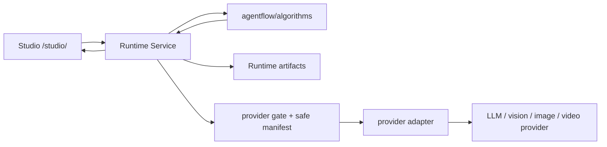

# AFS Algorithm Library 架构说明

## 定位

AFS 不是 provider UI，也不是把多个模型按钮拼在一个页面里。AFS 是 Agent-native 内容生产操作层：Studio 负责人的显式操作，Runtime 负责作业、artifact、gate 和 HTTP 投影，provider adapter 只返回 normalized result，核心产品语义沉到 `agentflow/algorithms/`。

本阶段的目标是把生成链路从散落逻辑收敛成可测试算法库。新业务规则不再直接堆进 `apps/api/runtime_*` route 文件；route 只保留 request validation、store/job/artifact、调用算法、safe error projection。

## 协作边界

Studio 不拼算法判断，只触发动作并展示 Runtime 返回的 safe state。Runtime 不保存 provider raw response、secret、signed URL、本地绝对路径或媒体字节。Feedback 是 raw evidence，不自动进入 durable memory。

## 算法族

| 算法 | 职责 | 输入 | 输出 | 失败模式 | 证据边界 |
|---|---|---|---|---|---|
| `asset_card_drafting` | 生成人物、场景、视频资产卡草稿 | asset type、safe artifact refs、prompt、provider service id | draft、confidence、missing fields、candidate locks、safe evidence | vision gate closed、缺媒体 ref、不支持类型、unsafe draft | draft 不进入 fixed asset，不参与上下文 |
| `fixed_asset_memory` | 管理 fixed/rejected/retired 资产记录和 public projection | human-reviewed payload、asset record、status | safe asset record、public detail、context-safe fixed assets | 缺 signature、空 feature card、draft 污染、unsafe projection | 只接受人工确认后的 safe fields |
| `context_resolver` | 裁剪本轮上下文资产、连线、锁定项、历史摘要 | context subgraph、fixed assets、exclusions、locks、prompt | context bundle、included/excluded、text channel、reference channel、warnings | invalid subgraph、资产未连接、预算裁剪、draft 被拒绝 | 只读 fixed asset memory，不信任前端伪造字段 |
| `creative_intent_control` | 把用户意图、专业规则和 provider 能力转成 canonical brief | user prompt、context bundle、director params、provider descriptor | canonical brief、constraint layers、provider prompt hints | 缺用户意图、约束冲突、unsafe prompt | brief 是产品语义，不是 provider raw |
| `provider_gate_manifest` | 管理 gate、capability、safe manifest、失败分类 | capability、required gate、provider metadata | gate state、blocked/succeeded safe manifest | gate closed、provider failed、unsafe manifest | 不含 secret/provider raw/signed URL/local path/media bytes |
| `quality_feedback_scoring` | 清洗结构化评分和漂移反馈 | Studio feedback、safe refs | sanitized raw evidence、bounded scores | 未知指标丢弃、文本脱敏、越界分数丢弃 | feedback 是 evidence，不是 memory |
| `revision_drift_control` | 表达 I2I/video revision 的 preserve/change 和 drift 风险 | base refs、revision intent、preserve/change、temporal scope | revision plan、drift risk summary | 缺 base、时间范围不支持、preserve/change 冲突 | 只引用 safe artifacts |
| `skill_action_selection` | 后续工具/skill/action 白名单选择 | task intent、allowed actions、gates | action mode、reason | unknown intent、capability not allowed、unsafe action | 只输出安全 action label，不执行任意工具 |

## 自动资产卡链路

1. 用户在 Studio 显式点击“自动识别生成草稿”。
2. Studio 调用 `POST /projects/{project_id}/asset-card-drafts`。
3. Runtime 检查 `AFS_ALLOW_REMOTE_VISION`。
4. gate closed 时返回 blocked safe manifest，`provider_calls_started=false`。
5. gate open 且 fake vision 时返回 character/scene/video draft。
6. draft 只回填表单，不写 fixed asset，不参与 context resolver。
7. 用户编辑并确认后，人物/场景走 visual asset promote；视频走 video asset promote。
8. context resolver 只读取 `fixed` 且 `human_confirmed=true` 的资产。

## Claim Boundary

| 状态 | 含义 |
|---|---|
| draft | 自动识别草稿，未人工确认，不参与生成上下文 |
| runtime verification | API/contract/test 通过，不代表真人体验通过 |
| provider smoke | 某能力在受控 gate 下真实调用成功，不代表商业质量 |
| human acceptance | 用户按 runbook 体验并接受当前版本 |
| durable memory | 经人工判断后进入长期规则或知识库 |

## 排障索引

| 现象 | 先查模块 | 检查点 |
|---|---|---|
| 资产识别错 | `asset_card_drafting` | draft、confidence、missing fields、safe evidence、vision provider normalized result |
| 草稿污染生成上下文 | `fixed_asset_memory` + `context_resolver` | draft 状态、promotion_review.human_confirmed、context bundle included assets |
| provider 被误触发 | `provider_gate_manifest` | capability、required gate、provider_calls_started、safe manifest blocks |
| provider 失败难分类 | `provider_gate_manifest` + adapter | failure_class、safe error、descriptor capability、gate 状态 |
| 固定人物/场景没进入 prompt | `context_resolver` | context_subgraph edges、visual_asset_ids、temporary exclusions、budget |
| 视频动作/连续性漂移 | `revision_drift_control` + `quality_feedback_scoring` | preserve/change boundary、temporal scope、drift notes、评分 |
| 评分不准或泄露信息 | `quality_feedback_scoring` | metric whitelist、redaction、safe_preview_ref、raw_evidence_policy |
| 工具/skill 误触发 | `skill_action_selection` | allowed action、capability gate、selection reason |

## 当前落地状态

本阶段已落地 executable slice：`asset_card_drafting`、`fixed_asset_memory`、`context_resolver`、`provider_gate_manifest`、`quality_feedback_scoring` 接入 Runtime 主线路径；`creative_intent_control`、`revision_drift_control`、`skill_action_selection` 先提供最小可测接口，后续按 provider/video revision 和 agent tool selection 的真实需求扩展。

未做事项：M4 真人测试、服务器 provider smoke、Nginx/systemd/provider secret 改动、durable memory 晋升。
