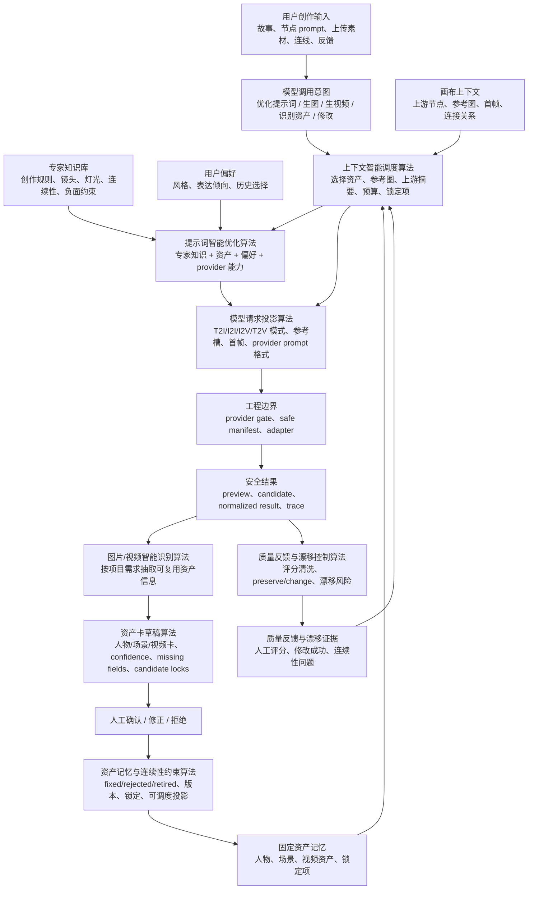
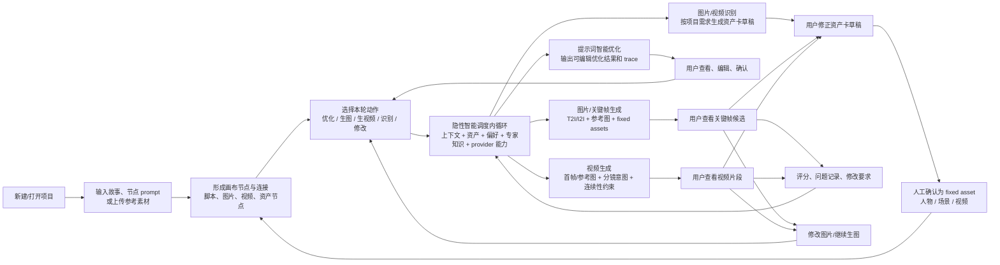

# AFS 核心算法与操作链路图谱（讨论草案 v2）

本文用于对齐 AFS Studio 下一阶段的核心思想，不是最终 PRD，也不声明功能已经全部落地。

文档类型：Explanation + Reference。
目标读者：AFS 产品/工程协作者和后续接手 Agent。
目标：把“真正值得作为核心技术架构迭代的智能体算法”和“用户核心操作链路”固定成两张可讨论、可迭代的项目内核心图。

## 这版修正的口径

上一版把一些流程编排、provider gate、证据记录也放进了“算法地图”。这个口径过宽。

本版采用更严格的判断标准：

```text
如果一个模块只是触发动作、创建 job、展示状态、记录 manifest，它不是核心智能体算法。

如果一个模块会基于项目知识、资产、用户偏好、上下游节点、provider 能力和质量反馈，
做选择、归纳、改写、约束、裁剪、排序或请求规划，它才进入核心智能体算法层。
```

因此，`provider_gate_manifest`、`artifact_lineage`、`skill_action_selection` 在当前阶段更适合作为工程护栏、证据设施或自动化路由，不和提示词优化、视觉理解、上下文调度并列为核心算法。

## 图一：AFS 核心智能体算法地图



### 核心算法族

| 算法族 | 当前项目对应证据 | 为什么算核心算法 | 当前成熟度 | 下一步优化重点 |
|---|---|---|---|---|
| 提示词智能优化算法 | `runtime_prompt_memory_engine.py`、`runtime_creative_agent.py`、`creative_intent_control`、专业知识库规则 | 不是模板改写，而是综合专家知识、节点参数、人物/场景资产、用户偏好、provider 能力，产出 canonical brief、候选评分和 provider prompt | 已有可运行主链路，但逻辑仍分散在 Runtime 和算法库 | 把 text/script、T2I、I2I、I2V/T2V 的优化策略收敛为统一算法接口 |
| 上下文智能调度算法 | `context_resolver`、`runtime_context_resolver.py`、`runtime_context_text.py` | 每次模型调用前，决定使用哪些 fixed asset、上游节点摘要、参考图、锁定项、用户偏好和预算裁剪 | 当前最接近核心算法的稳定底座 | 明确“每次模型调用必经”的统一 request context contract |
| 图片/视频智能识别算法 | `provider_fake_vision.py`、`runtime_asset_card_drafts.py`、`asset_card_drafting` | 视觉模型结果不能原样展示，必须按用户和项目需求选择性抽取成可编辑资产信息 | 目前是真 vision 接口和 fake/规则草稿的安全投影，真实理解层待加强 | 拆出 `visual_understanding` normalization 层，区分 provider 识别、项目筛选和资产卡呈现 |
| 资产记忆与连续性约束算法 | `fixed_asset_memory`、`context_resolver.assets` | 人物/场景/视频资产一旦固定，会反向影响后续所有模型调用的身份、场景、风格、锁定和参考图选择 | 已有 fixed/draft 隔离和资产选择规则 | 强化版本、同名资产仲裁、视频资产生命周期、负面锁定和引用优先级 |
| 模型请求投影算法 | `creative_intent_control.video_prompt`、`runtime_context_text.provider_prompt_from_bundle`、provider descriptor | 同一创作意图进入不同模型前，需要被翻译成特定调用格式，包括 T2I/I2I/I2V/T2V、参考槽、首帧和负面约束 | 视频 prompt slice 已开始下沉，图像侧仍较分散 | 将 image/video request plan 从 route 中抽成可测算法对象 |
| 质量反馈与漂移控制算法 | `quality_feedback_scoring`、`revision_drift_control`、视频 revision contract | 用户评分和修改反馈不是记忆，但会成为下一轮调度和修改的 evidence | 当前是最小可测接口，算法含量还不够 | 建立 identity、wardrobe、scene continuity、target change success、video drift 等指标闭环 |

### 辅助层，不作为核心算法并列

| 对象 | 当前定位 | 原因 |
|---|---|---|
| `provider_gate_manifest` | 工程护栏和安全证据 | 控制能不能调用 provider，不决定创作内容质量 |
| `artifact_lineage` | 证据和追溯设施 | 记录来源关系，不负责智能选择或优化 |
| `skill_action_selection` | 后续自动化路由候选 | 当前主要是动作白名单和路由，还不是内容生产核心算法 |
| `storyboard_breakdown` | 未来高价值算法候选 | 当前尚未作为正式算法对象落地，不能写成“主要已实现算法” |

## 模型调用的统一内循环

AFS 的核心不是“用户点一次按钮就直接调模型”，而是每次模型调用前都有一个隐性智能内循环：

```text
用户本轮意图
-> 读取节点本地 prompt 和参数
-> 读取画布上游节点、连线、参考图和首帧
-> 读取 fixed asset memory 中可用的人物/场景/视频资产
-> 读取专家知识库和用户偏好
-> 读取历史质量反馈和漂移证据
-> 按 provider 能力、参考槽、prompt 长度和安全边界裁剪
-> 生成本轮 context bundle、canonical brief、provider request plan
-> 经过 gate 后才提交给 LLM / image / video / vision provider
```

这个内循环应成为 AFS Studio 的底层技术主线。后续 UI 和自动化都应该围绕它展开，而不是绕过它直接暴露模型按钮。

## 图二：用户核心操作链路（含隐性智能调度）



### 核心链路的新口径

```text
显式链路：
项目/素材/节点 -> 选择动作 -> 模型输出 -> 人工查看/确认 -> fixed asset / feedback -> 下一轮动作

隐性链路：
每次模型调用前 -> 上下文智能调度 -> 提示词智能优化或请求投影 -> provider-safe 调用
```

所以用户核心链路不应只写成：

```text
故事/素材 -> 分镜节点 -> 关键帧 -> 固定资产 -> 视频片段
```

更准确的口径是：

```text
故事/素材/节点
-> 本轮模型调用意图
-> 上下文与资产智能调度
-> 提示词/请求智能投影
-> 图片、视频或视觉识别结果
-> 人工确认资产或反馈
-> 资产和反馈反哺下一轮模型调用
```

分镜节点是重要入口，但不应是唯一入口。AFS 还必须允许用户从已有图片、视频、资产卡、上传素材或某个中间节点直接进入下一轮调用。

## 用户动作与算法触发关系

| 用户看到的动作 | 背后的核心算法 | 不应被误解为 |
|---|---|---|
| 优化提示词 | 提示词智能优化 + 上下文智能调度 | 套模板或简单润色 |
| 生图/生成关键帧 | 上下文智能调度 + 请求投影 + 提示词智能优化 | 直接把输入框文本发给图片模型 |
| 用参考图生图 | 上下文智能调度 + 参考图选择 + 局部修改 preserve/change 判断 | 只上传一张图 |
| 用首帧生成视频 | 上下文智能调度 + 视频请求投影 + 连续性约束 | 只把图片传给视频模型 |
| 自动识别图片/视频 | 视觉理解 + 项目需求筛选 + 资产卡草稿 | 原样展示视觉模型 JSON |
| 固定人物/场景/视频资产 | 资产记忆与连续性约束 | 普通收藏或素材库 |
| 修改图片/视频 | 漂移控制 + 质量反馈 + 下一轮调度 | 单次重新生成 |
| 评分和反馈 | 质量反馈清洗 + evidence 进入下一轮调度 | 自动晋升长期记忆 |

## 当前要对齐的关键判断

1. AFS 的底层核心应以“模型调用前的智能调度和智能投影”为中心，而不是以 provider 按钮或流程节点为中心。
2. 提示词优化是核心算法，但它必须吸收专家知识、资产记忆、用户偏好、上下游节点和 provider 约束，不能退化成 prompt 模板。
3. 视觉识别的价值不是识别本身，而是把图片/视频内容按项目需要转成可确认、可复用、可调度的资产卡。
4. 上下文调度是每次 LLM/image/video/vision 调用的前置核心能力，不只是“生成时附带资产”。
5. fixed asset 和 feedback 是下一轮模型调用的输入，不只是结果展示。
6. provider gate、safe manifest、artifact lineage 是必要工程边界，但不应冒充核心智能算法。

## 下一轮讨论建议

如果这版口径成立，下一步不急着扩功能，而应先把三件事定清楚：

1. 核心算法命名和边界：尤其是“提示词智能优化”“上下文智能调度”“视觉理解资产化”的正式 contract。
2. 每次模型调用的统一 request context：哪些字段必须存在，哪些字段是 optional，哪些字段绝不能进 provider。
3. 用户链路中的确认边界：哪些可以自动草稿，哪些必须人工确认后才能进入 fixed asset 和下一轮上下文。

## 非声明

- 本文不是最终产品方案。
- 本文不声明任一 provider 已通过 smoke。
- 本文不声明 human acceptance、business validation 或 durable memory promotion。
- 本文不授权任何 live provider 调用。
