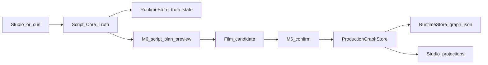

# Script Flow Findings — Chinese Path (2026-08-01)

Local working note from the agent-kernel trace work in
`/home/afs-ops/worktrees/afs-agent-working-mode-20260729`.

Focus: **Chinese-language script flow only** (the product’s real input language).
Related notes:

- `docs/internal-notes/script-flow-trace-20260801.md`
- `docs/internal-notes/script-flow-risks-20260801.md`
- `docs/internal-notes/script-flow-codex-run-20260801.md` (《海边的信》 sample)

Runtime used for the live samples (local temp only, not `/opt`):

```text
runtime root: /tmp/afs-script-flow-last-light
project_id:   proj_last_light_20260801
port:         127.0.0.1:8797
planner:      local_deterministic (AFS_ALLOW_REMOTE_LLM unset)
```

---

## Central finding

**Deterministic M6 extraction success is format-dependent, not comprehension-based.**

It works well when the Chinese script uses explicit labeled fields (`地点：` / `人物：`), but on standard inline-prose screenplay format it can still report `succeeded` / `PASS` while emitting **meaningless fragment labels**.

《海边的信》(longer inline, 3 characters) further confirms this is not limited to bad scene names: **character detection can fail completely too** (wrong fragment “names”), while validation still reports **PASS with zero P0/P1 errors**.

So `phase: succeeded` currently means “structure checks cleared for some tokens,” **not** “the agent understood the script.”

Evidence: three Chinese scripts on the same project, same deterministic planner, same zero remote dispatch — uneven understanding quality, same success status.

---

## 1) How a Chinese script moves through the system



### Step A — Script Core Truth

| | |
|---|---|
| Entry | `POST /projects/{project_id}/script-revisions` |
| File | `apps/api/runtime_script_core_truth.py` → `create_script_revision` |
| In | `source_kind: "script"`, Chinese `source_text`, optional `parent_revision_id` / `provenance` |
| Out | `revision_id` (`scrrev_*`), `source_digest`, projection with `analysis_state: analysis_required` |
| Store | `{runtime_root}/projects/{id}/script_core_truth/truth_state.json` |

Chinese revisions created today on `proj_last_light_20260801`:

| Script | Revision id | Format style |
|---|---|---|
| 《最后的光》 | `scrrev_72ae32029f274e74` | Inline heading: `第一场 - 内景 - 废弃灯塔 - 夜` |
| 《归途》 | `scrrev_0ef51148a4f94c59` | Labeled fields: `地点：小镇火车站` / `人物：陈浩…` |
| 《海边的信》 | `scrrev_9f3d686832b74175` | Longer inline prose; expected cast `苏晴` / `老王` / `林悦` |

### Step B — M6 script-plan preview (deterministic)

| | |
|---|---|
| Entry | `POST /projects/{project_id}/m6/script-plan-asset-bible/preview` |
| Headers | `X-Client-Request-ID` required |
| File | `apps/api/runtime_m6_script_plan_asset_bible.py` |
| Planner | `build_m6_script_plan_asset_bible` when remote Codex gate is closed |
| In | Must bind to **current** Script Truth: `source_revision_id` + `source_revision_digest` + same `source_text` |
| Out | Preview run (`phase: succeeded` / `failed`) + optional film candidate |
| Store | `{runtime_root}/projects/{id}/m6_preview_runs/{run_id}/run.json` |

Both Chinese previews used:

- `provider.service`: `local_deterministic`
- `dispatch_count`: `0`
- no remote LLM

### Step C — Production Graph (not executed in today’s samples)

| | |
|---|---|
| Entry | `POST .../m6/script-plan-asset-bible/confirm` |
| Compile | `compile_film_candidate(...)` in `runtime_film_production_graph.py` |
| Persist | `ProductionGraphStore.append(...)` → `production_graph/graph.json` |

Today stopped at **preview** for both Chinese scripts. No Production Graph confirm was run.

Director Compiler remains a **generation side path** (prompt/context), not the script→graph middle hop.

---

## 2) Structural risks on this path

### Duplicate / overlapping implementations

- Multiple “script” representations: Script Core Truth revision, M6 embedded `script_revision`, canvas script nodes, legacy `ShortVideoScript`.
- Parallel shot/planning paths: M6 → `ProductionGraphStore` vs storyboard-breakdown graph builder.
- Dual Director compilers (v1 / v2) on the generation side.
- Multiple Studio call sites for script-revision create + projection.

### Oversized modules

Approximate sizes observed in this worktree:

| Module | ~LOC |
|---|---:|
| `apps/studio/src/product-shell.js` | ~5963 |
| `apps/studio/src/agent-chat-lifecycle.js` | ~2691 |
| `apps/api/runtime_embedded_creative_actions.py` | ~2020 |
| `apps/api/runtime_m6_script_plan_asset_bible.py` | ~1336 |
| `apps/api/runtime_script_core_truth.py` | ~1234 |
| `apps/api/runtime_film_production_graph.py` | ~837 |

These mix routes, planning, validation, persistence, and UI orchestration in single files.

### Missing / weak formal schemas

- Script Truth request bodies are Pydantic; persisted revision/asset state is mostly hand-built dicts.
- Analysis `beats` remain loosely typed (`list[dict]`).
- M6/film candidate validation is custom (`validate_m6_candidate`), not one shared domain schema package.
- No single shared schema for Chinese `Script → Scene → Beat → Shot → AssetRequirement`.

### Implicit / weakly versioned state

- Three stores can drift: Studio canvas state, Script Truth, Production Graph.
- “Current revision” is selected in Script Truth but also cached in Studio projections.
- M6 preview runs are async/recoverable; confirm depends on digests + graph version.
- Authority is partly inferred (`production_graph_authoritative` from non-empty graph), not a clear lifecycle state machine.

### Hard-to-test model calls

- Server Codex planner (`runtime_m6_server_codex_planner.py`) couples to live provider registry when `AFS_ALLOW_REMOTE_LLM` is enabled.
- Deterministic planner is independently testable; remote path is not without fakes.

Highest-leverage cleanup remains: one Script Truth authority, one formal Chinese script hierarchy schema, fakeable planner port, split oversized Runtime modules.

---

## 3) Three Chinese tests — format-dependent “success”

### Evidence table

| | Test A 《最后的光》 | Test B 《归途》 | Test C 《海边的信》 |
|---|---|---|---|
| Script Truth revision | `scrrev_72ae32029f274e74` | `scrrev_0ef51148a4f94c59` | `scrrev_9f3d686832b74175` |
| Screenplay format | Inline prose heading: `第一场 - 内景 - 废弃灯塔 - 夜` | Explicit labels: `地点：…` / `人物：…` / `时间：…` | Longer inline prose screenplay (3 named characters: `苏晴` / `老王` / `林悦`) |
| M6 run | `m6-preview-e545712950944b5da974593c` | `m6-preview-411f110421fc7300541ff8b1` | `m6-preview-845622dd85209849cea53c82` |
| Planner | local_deterministic | local_deterministic | local_deterministic |
| Remote dispatch | 0 | 0 | 0 |
| `phase` / `status` | **succeeded** / `preview_ready` | **succeeded** / `preview_ready` | **succeeded** / `preview_ready` |
| Validation | PASS | PASS | **PASS** (`P0: 0`, `P1: 0`, canonical scope PASS) |
| Expected characters | `玛雅` | `陈浩`, `林秀` | `苏晴`, `老王`, `林悦` |
| Detected characters | `玛雅` | `陈浩`, `林秀` | **`苏晴没`**, **`从信封`**, **`道他可能`** |
| Character quality | Correct (single short name) | Correct (labeled `人物：`) | **Complete failure** — fragment junk, none of the 3 real names |
| Expected scenes | `废弃灯塔`, `灯塔阳台` | `小镇火车站`, `陈浩家中的老屋` | `老式邮局`, `海边礁石`, `苏晴的房间` |
| Detected scenes | **`颤抖`**, **`灯上`** | **`小镇火车站`**, **`陈浩家中的老屋`** | **`柜台前`**, **`柜台上`**, **`礁石上`**, **`她身边坐下`**, **`书桌前`**, **`一叠信纸上`** |
| Scene quality | Fragment junk / false positive | Meaningful locations | Fragment junk / false positive |
| Candidate script revision id | `m6-script-8f53ff3a7d40` | `m6-script-5827f5eb3c3f` | `m6-script-e1fff68b2c36` |
| Lineage source revision | `scrrev_72ae32029f274e74` | `scrrev_0ef51148a4f94c59` | `scrrev_9f3d686832b74175` |

### Format snippets

Test A (inline heading — wrong scenes, still succeeded):

```text
第一场 - 内景 - 废弃灯塔 - 夜
...
第二场 - 外景 - 灯塔阳台 - 连续
```

Extractor used narration fragments instead (`颤抖`, `灯上` from phrases like “光在颤抖” / “放在灯上”).

Test B (explicit labels — correct characters + scenes, also succeeded):

```text
第一场
时间：清晨
地点：小镇火车站
人物：陈浩（40多岁，疲惫，眼神坚定）
...
第二场
时间：正午
地点：陈浩家中的老屋
人物：陈浩、林秀（60多岁，陈浩的母亲）
```

Test C 《海边的信》(longer inline prose — character detection failed completely, still succeeded):

- Expected cast: `苏晴`, `老王`, `林悦`
- Extracted “characters”: `苏晴没`, `从信封`, `道他可能`
- Expected locations: `老式邮局`, `海边礁石`, `苏晴的房间`
- Extracted “scenes”: `柜台前`, `柜台上`, `礁石上`, `她身边坐下`, `书桌前`, `一叠信纸上`
- Validation still reported **PASS with zero errors** (`P0: 0`, `P1: 0`)

Full Codex run record: `docs/internal-notes/script-flow-codex-run-20260801.md`.

### Interpretation

1. **Same success status across all three cases** does not mean same understanding quality.
2. Explicit `地点:` / `人物:` fields align with the deterministic extractor → useful labels (Test B).
3. Inline Chinese screenplay format can clear structural gates with **meaningless scene fragments** (Test A).
4. On 《海边的信》(longer inline, 3 characters), **character detection failed completely too** — not only scene labels — while validation still reported PASS with zero errors (Test C).
5. Therefore the junk-extraction result is a **consistent format-sensitivity pattern**, not a fluke limited to one short script.
6. Product risk: creators writing normal screenplay prose can get a green “制作方案 ready” signal while Production Graph would be grounded on wrong people and places.

---

## 4) Confirmed dual-revision-id issue

All three Chinese successes show the same identity split:

| Script | Script Truth `scrrev_*` | Candidate embedded `m6-script-*` | Lineage source |
|---|---|---|---|
| 《最后的光》 | `scrrev_72ae32029f274e74` | `m6-script-8f53ff3a7d40` | matches Script Truth |
| 《归途》 | `scrrev_0ef51148a4f94c59` | `m6-script-5827f5eb3c3f` | matches Script Truth |
| 《海边的信》 | `scrrev_9f3d686832b74175` | `m6-script-e1fff68b2c36` | matches Script Truth |

M6:

1. correctly records lineage back to Script Truth, **and**
2. invents a second script-revision identity inside the candidate.

Downstream consumers can bind to the wrong id.

**Desired contract:** candidate must reuse / only reference Script Truth `scrrev_*` (+ digest). Do not mint a second script-revision identity during planning.

---

## Immediate conclusions for Chinese kernel work

1. Script Truth → M6 preview → (optional) confirm → Production Graph is the real Chinese planning spine.
2. Deterministic M6 “success” is **format-dependent**, not proof of comprehension.
3. Support both common Chinese formats: labeled metadata blocks **and** inline prose / heading screenplays — with tests that fail on fragment labels.
4. Treat false-positive **scene and character** extraction as a P0 understanding defect, even when `validation.verdict = PASS` with zero P0/P1 errors.
5. Longer inline scripts can break character detection completely while still reporting success — do not assume only scene labels are fragile.
6. Remove dual `m6-script-*` revision ids before treating M6 output as production authority.
7. Keep remote LLM gated; harden deterministic understanding + schemas so PASS means real comprehension.

---

## 5) Technical root cause — regex extraction + weak validation

Code path (deterministic planner, remote LLM closed):

```text
build_m6_script_plan_asset_bible
  → m6_source_canonical_scope(source_text)
      → _extract_named_characters(text)
      → _extract_scenes(text)
  → _character_row / _scene_row (fill templates around whatever strings were returned)
  → validate_m6_candidate (structural / required-field checks)
```

File: `apps/api/runtime_m6_script_plan_asset_bible.py`.

### Extraction is regex / keyword-based, not language understanding

1. **Preferred path (works for 《归途》):** look for labeled lines such as `人物：…` / `角色：…` and `地点：…` / `场景：…`, then split the list after the colon (`_extract_list_after_labels` / `_extract_declared_names`).
2. **Fallback path (fires for inline prose like 《最后的光》 / 《海边的信》):** when those labels are absent, use brittle regex heuristics:

| Entity | Fallback pattern (substance) | What it actually captures |
|---|---|---|
| Character | 2–4 Chinese chars **immediately before** a small verb list (`说\|问\|看\|走\|跑\|递\|打开\|发现\|决定\|进入\|握住\|停下`) | Whatever substring sits next to the verb — not a validated name |
| Scene | text after `在\|进入\|回到`, until `里\|内\|上\|下\|前\|后` or punctuation | Location-*ish* fragments from narration, not scene headings |

There is no NER, no cast list, no screenplay heading parser, and no check that the capture is a person or place entity. `_clean_label` only strips whitespace.

### Why 《海边的信》 produced junk

Inline prose, so labels were empty → fallback regex ran:

- `苏晴没说话` → verb match on `说` → capture **`苏晴没`** (not `苏晴`).
- Similar verb-adjacent slices yield fragments like **`从信封`**, **`道他可能`** instead of `老王` / `林悦`.
- `在柜台前，` / `在柜台上。` / `在她身边坐下。` → scene captures **`柜台前`**, **`柜台上`**, **`她身边坐下`**, etc.
- Real locations such as `老式邮局` / `海边礁石` often never match because the prose uses forms like `走进…` (prefix not in `在|进入|回到`) or headings without that wrapper.

### Validation only checks “did something get extracted,” not “is it a real entity”

`validate_m6_candidate` (and related scope checks) require roughly:

- at least one character row and one scene row (plus enough shots);
- required **fields present** on those rows (`display_name`, `goal`, `space`, `time_of_day`, …);

It does **not** require that `display_name` / `name` be attested names/locations from the script, nor that they fail a fragment/junk test. Junk strings still receive full `_character_row` / `_scene_row` templates (generic goals, continuity text, etc.), so structural gates clear.

**Therefore:** `phase: succeeded` + `validation.verdict = PASS` with `P0: 0` / `P1: 0` can mean “regex returned non-empty tokens and templates filled,” **not** “the planner understood characters and scenes.” That is the mechanical reason format-sensitive junk still reports success.

---

## Non-claims

- Local temp Runtime evidence only.
- No Production Graph confirm was run for these Chinese samples.
- Not provider QA, human acceptance, SaaS readiness, or live `/opt` deploy verification.
- No GitHub push / `master` merge from this note.
