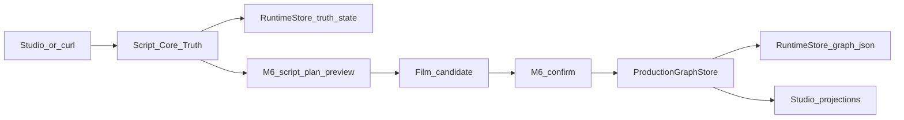

# Script Flow Trace — §7.1 Findings (2026-08-01)

Local working note for task **§7.1** (trace the agent call chain / key data structures) in
`/home/afs-ops/worktrees/afs-agent-working-mode-20260729`.

Related notes:

- `docs/internal-notes/script-flow-findings-20260801.md` — Chinese format-sensitivity evidence
- `docs/internal-notes/script-flow-risks-20260801.md` — structural risks detail
- `docs/internal-notes/script-flow-codex-run-20260801.md` — 《海边的信》 Codex run archive

Evidence runtime for live samples (temp only, not `/opt`):

```text
runtime root: /tmp/afs-script-flow-last-light
project_id:   proj_last_light_20260801
port:         127.0.0.1:8797
```

---

## 1) Full trace — Script Truth → M6 → Production Graph → Studio

Director Compiler is **not** a middle hop on this chain (see §2).



### Step A — Script Core Truth

| | |
|---|---|
| Entry | `POST /projects/{project_id}/script-revisions` |
| File | `apps/api/runtime_script_core_truth.py` → `create_script_revision` |
| In | `source_kind`, Chinese/English `source_text`, optional `parent_revision_id` / `provenance` |
| Out | `revision_id` (`scrrev_*`), `source_digest`, projection (`analysis_state`, assets) |
| Store | `{runtime_root}/projects/{id}/script_core_truth/truth_state.json` |
| Current binding | `current_script_revision_binding(store, project_id)` → `{revision_id, source_digest}` |

Also: `GET .../script-truth`, `POST .../script-revisions/{id}/select`, analysis-candidates, core-asset commands.

### Step B — M6 script-plan preview

| | |
|---|---|
| Entry | `POST .../m6/script-plan-asset-bible/preview` (+ `X-Client-Request-ID`) |
| Files | `runtime_m6_script_plan_asset_bible.py`, `runtime_m6_preview_runs.py`, optional `runtime_m6_server_codex_planner.py` |
| Gate | `server_codex_m6_enabled()` ← `AFS_ALLOW_REMOTE_LLM` in `{1,true,yes,on}` |
| Planner | `_preview_planner(remote)` → `build_m6_server_codex_script_plan_asset_bible` **or** `build_m6_script_plan_asset_bible` |
| In | Must match **current** Script Truth: `source_revision_id` + `source_revision_digest` + same `source_text` (`_require_current_m6_script_binding`) |
| Out | Preview run under `m6_preview_runs/{run_id}/run.json`; on success: film candidate + digest |
| Deterministic extract | `m6_source_canonical_scope` → `_extract_named_characters` / `_extract_scenes` (label lists, else regex) |

### Step C — M6 confirm → Production Graph

| | |
|---|---|
| Entry | `POST .../m6/script-plan-asset-bible/confirm` |
| Compile | `compile_film_candidate(...)` in `runtime_film_production_graph.py` |
| Persist | `ProductionGraphStore.append(...)` → `production_graph/graph.json` |
| Binding | Confirm rejected if Script Truth revision/digest drifted (`_require_current_m6_candidate_binding`) |

### Step D — Studio projections

| | |
|---|---|
| Client | `apps/studio/src/runtime-client.js` (`createScriptRevision`, `previewM6ScriptPlanAssetBible`, `confirmM6ScriptPlanAssetBible`) |
| Script UI | `script-core-truth-projection.js` ← `applyScriptCoreTruthProjection` |
| Graph UI | `production-graph-workspace-projection.js` |
| Call sites | `product-shell.js`, `agent-chat-lifecycle.js`, `embedded-creative-actions.js` |

**End-to-end:** Studio/curl saves script revision → M6 preview (bound to current revision) → optional confirm → graph events sealed in Runtime Store → Studio reprojects canvas. Generation (keyframe/video/prompt) is a **separate** loop that may consume director setup + context resolver.

---

## 2) Director Compiler — prompt compiler, not script→graph

| | |
|---|---|
| Files | `apps/api/runtime_director_compiler.py` (`compile_director_setup`), `runtime_director_compiler_v2.py` (`compile_director_scene_blocking`) |
| Input | `DirectorSetup2D` (v1): cameras/subjects/lights/props + `activeCameraId` / `activeSubjectIds`; v2: `DirectorSceneBlockingV1` |
| What it does | Deterministic geometry → six Chinese cinematography sections (主体调度 / 机位景别 / 光线 / 空间道具 / 运动连续 / 负面约束); no LLM; no Script Truth write; no graph write |
| Output | `director_compile_result.v1` (or blocking compile result) with `sections[]`, warnings, active ids |
| Consumers | `runtime_context_resolver` / `resolve_context_bundle_core` → `text_channel.scene_director_segment` for prompt/keyframe paths |

**Clarification:** This is **not** the same concept as M6’s production plan (characters/scenes/shots/assets → film candidate → Production Graph). It is a **stage/blocking → cinematography prompt** side path on the generation loop.

```text
Script Truth → M6 → Production Graph     ← planning spine
DirectorSetup2D → compile_director_setup → context bundle → generate  ← generation side path
```

---

## 3) Context selection — rule-based + provider config (no model judgment)

Files:

- `apps/api/runtime_context_resolver.py` → `resolve_context_bundle` → `agentflow/algorithms/context_resolver.resolve_context_bundle_core`
- `apps/api/runtime_context_subgraph.py` — validate subgraph; BFS connected assets/hops; upstream summaries
- `apps/api/runtime_context_budget.py` — character budget waterfall (`generate` truncates; lock/identity never truncated)

| Decision | Who decides | Style |
|---|---|---|
| Which assets / text / refs | Context resolver | Deterministic rules |
| Char limit / ref slots | Provider `descriptor` (`prompt_char_limit`, `reference_image_slots`) | Config-driven |
| Skills / tools | Not these modules | See §4 |
| Model/service | Request `provider_service_id` + registry + `AFS_ALLOW_REMOTE_*` | Request + config + gate |

### Concrete example — keyframe generate

In `apps/api/runtime_keyframes.py`:

1. Client sends keyframe request with `context_subgraph`, prompt, optional `director_setup`, `provider_service_id`.
2. Registry descriptor supplies `prompt_char_limit` / `reference_image_slots`.
3. `resolve_context_bundle(mode="generate", ...)` includes connected **fixed** assets only; compiles director sections; builds identity locks.
4. Budget truncates preference → upstream → director → visible (above floor); locks stay.
5. `provider_prompt_from_bundle` concatenates segments → image dispatch (or gate-blocked).

Nothing asks a model “what context should I include?”

---

## 4) Skill / tool selection — unused stub vs real product choice

### `skill_action_selection` (algorithm library)

File: `agentflow/algorithms/skill_action_selection/__init__.py`

- `select_action(intent)` = exact membership in hardcoded `ALLOWED_ACTIONS` (`prompt_optimization`, `keyframe_generation`, `video_generation`, `asset_card_draft`), else `manual_review` / blocked.
- **Not wired** into Runtime’s Script Truth / M6 / keyframe spine (auxiliary module only; see `AFS_ALGORITHM_LIBRARY.zh-CN.md` / core algorithm map).
- `agentflow/skills/` reports `RUNTIME_STATUS = "not_implemented"`.
- `agentflow/harness/agentflow_router.py` `validate_router_decision_dry_run` only validates a prewritten `selected_skill_id` artifact; `runtime_status: "not_implemented"`; does not choose or execute skills.

**Live-run confirmation** (Cursor + Codex, independently):

```text
select_action("video_generation")
→ {action: video_generation, mode: allowed, reason: whitelisted_action}

select_action("delete_project")
→ {action: manual_review, mode: blocked, reason: intent_not_whitelisted}
```

### Where tools actually get chosen today

| Path | Mechanism |
|---|---|
| Studio buttons / API | Explicit action (`optimize-prompts`, M6 preview, `action_type: script_revision\|shot_breakdown`) |
| Agent chat | Keyword/regex intent parse in `apps/studio/src/agent-chat-lifecycle.js` (e.g. `generationPreviewIntent`, `nodeCreationIntent`) |
| Workflow draft/execution | YAML `step.type` → `workflow_engine` registry; catalog in `configs/tool_catalog.yaml` is metadata / draft planning, not a chooser |

Example: `workflows/video_to_transcript.yaml` hardcodes `transcribe_audio_mock`; `video_to_transcript_real_asr.yaml` hardcodes `transcribe_audio_openai_compatible` — tool choice = which workflow file, not a runtime router.

**Bottom line:** no genuine model/heuristic ranking of competing skills for a task on the production spine.

---

## 5) Human edits → subsequent model call

| Edit | Enters next model/M6 call? | Mechanism |
|---|---|---|
| Script text saved as new Script Truth revision | **Yes** | `create_script_revision` → new `scrrev_*` + digest; next M6 must rebind (`_require_current_m6_script_binding`) |
| Embedded creative apply of `revised_text` | **Yes (script)** | Creates new script revision with `parent_revision_id` |
| Core-asset `edit_asset` rename only | **No for M6 names** | M6 re-extracts from `source_text` via `m6_source_canonical_scope`, not asset store labels |
| Edit scene name inside M6 candidate UI only | **Unsupported** | No first-class candidate patch → next planner call |
| M6 `revision_instruction` + `parent_candidate_digest` | API exists; Studio main path **does not send** | Under-wired |

### Concrete example — edit scene name after M6

1. M6 preview produced scene labels (possibly junk like `柜台前`).
2. Renaming only in preview UI does **not** feed a new planner call.
3. Confirm still uses the stored candidate as-is.
4. Editing Script Truth text (e.g. `地点：滨海邮局`) + new revision → old preview **cannot confirm** (`preview_source_revision_changed`); must re-run M6 with new binding → extraction/LLM sees new `source_text`.

**Verdict:** Clean for **script-text** revisions; broken/unsupported for **plan-level** edits (scene/candidate field patches) without rewriting source and re-running.

---

## 6) Exception / retry / recovery (fails closed)

Evidence: English script M6 failure on `proj_last_light_20260801` (`run_id` `m6-preview-6882bab0ef907986b3c0bdd1`) + `tests/test_runtime_m6_preview_durable_recovery.py`.

### Failure path (English sample)

1. Deterministic planner: `_extract_scenes` found **no scenes** for English `INT./EXT.` headings.
2. `build_m6_script_plan_asset_bible` raised `M6PlanningError("... at least one concrete scene...")`.
3. `_execute_preview_run` → `run_store.fail(...)`.
4. Terminal run: `phase=failed`, `error.category=planning_rejected`, message includes **制作事实未改变**; empty `candidate_digest`; **no** `production_graph` write; Script Truth unchanged.

### Retry / resubmit

| Resubmit | Behavior |
|---|---|
| Same `X-Client-Request-ID` + same source | Reuse existing run; if already failed, `submit_m6_preview_run` only schedules when `phase==queued` → **no silent re-plan** |
| Same client id + different source | `preview_source_digest_mismatch` |
| New client request id | **New** run / new attempt |
| After prune/tombstone | `preview_run_expired` |

`run_id` = hash(`owner` + `project` + `client_request_id`) via `preview_run_id`.

### Crash / timeout

| Situation | Recovery (`M6PreviewRunStore.recover`) |
|---|---|
| Planner/LLM timeout / exception | `fail` → terminal `failed` (e.g. `error.category=timeout`); no graph; same client id does not redispatch |
| Process dies while `queued`, `dispatch_count=0` | `failed_before_dispatch` / `submission_interrupted` |
| Process dies while `running` | `failed_after_dispatch` / `dispatch_result_unrecoverable` — **will not auto-resubmit** |
| Worker still active | Leave run running |

Designed fail-closed: orphaned ledger never blindly redispatches (see durable recovery tests). Remote provider may still have done work after `failed_after_dispatch`; Runtime will not invent a success.

---

## 7) Structural risks (summary)

Full tables: `docs/internal-notes/script-flow-risks-20260801.md`.

| Risk class | Evidence |
|---|---|
| **Duplicates** | Multiple script representations (Script Truth / M6 embedded `m6-script-*` / canvas / legacy `ShortVideoScript`); parallel shot paths (M6 graph vs storyboard-breakdown); dual Director compilers; multiple Studio create-revision call sites |
| **Oversized modules** | e.g. `product-shell.js` ~5963 LOC, `agent-chat-lifecycle.js` ~2691, `runtime_embedded_creative_actions.py` ~2020, `runtime_m6_script_plan_asset_bible.py` ~1336, `runtime_script_core_truth.py` ~1234 |
| **Missing schemas** | Analysis `beats: list[dict]`; M6 candidate via custom `validate_m6_candidate` not a shared domain schema; no single `Script → Scene → Beat → Shot → AssetRequirement` contract |
| **Implicit state** | Studio canvas vs Script Truth vs Production Graph can drift; dual revision ids; `production_graph_authoritative` inferred from non-empty graph |
| **Hard-to-test model calls** | `runtime_m6_server_codex_planner.py` couples to live provider registry when LLM gate open; deterministic planner independently testable |

Highest-leverage cleanup (from risks note): one Script Truth authority; stop minting second `m6-script-*` revision ids; formal Chinese hierarchy schema; fakeable planner port; split oversized Runtime modules.

---

## Non-claims

- Local worktree + temp Runtime evidence; not a claim about live `/opt` SaaS readiness.
- Not provider QA, human acceptance, or business validation.
- No GitHub `master` merge implied by this note.
